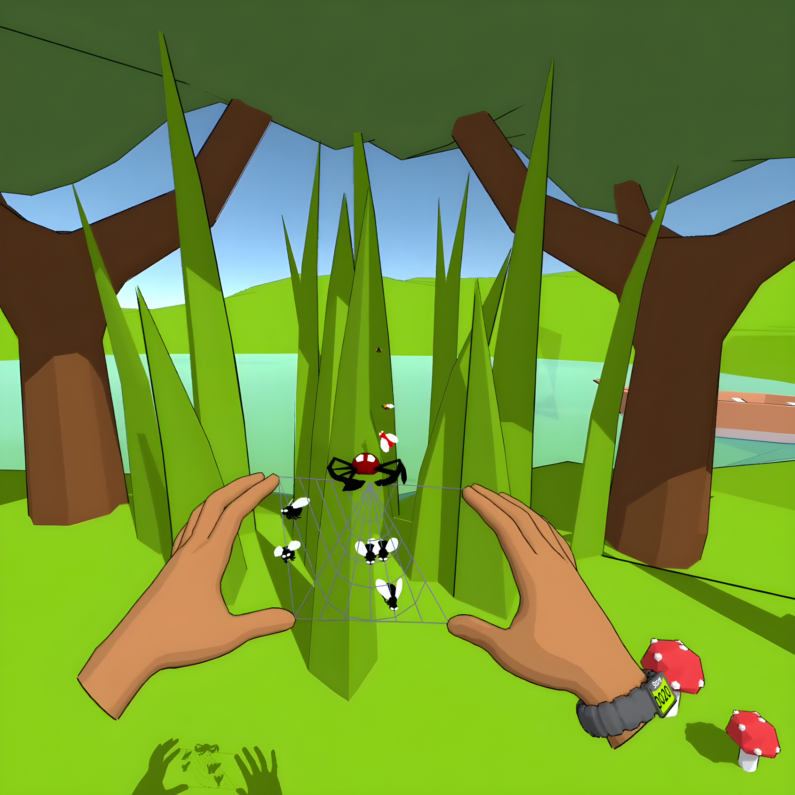

[<a href="/">Press kit</a>] [<a href="/privacypolicy">Privacy policy</a>] [<a href="/terms">Terms and Conditions</a>]

# Press kit for flybye

## Fact Sheet

- Developer: Electricity Studios (just a solo dev - Greg Wilk - typing away from the UK)
- Release Date: 15th September 2022
- Platform: Oculus Quest 2
- Price: 9.99$
- Language: English
- Contact: studioselectricity@gmail.com
- Storepage: https://www.oculus.com/experiences/quest/7710148255723398/

## Trailer

[Link to YouTube](https://youtu.be/gDs67FJsAZY)

## Description

Forget about buttons and joysticks. With the Quest 2, you control a spiderweb using hand tracking!

Help your spider friend on a quest to eat as many flies as possible, but be careful - bees rip the web apart!

The web is sticky but fragile. Manoeuvre it. Stretch it. Fix it.

## Screenshots

## Logos

